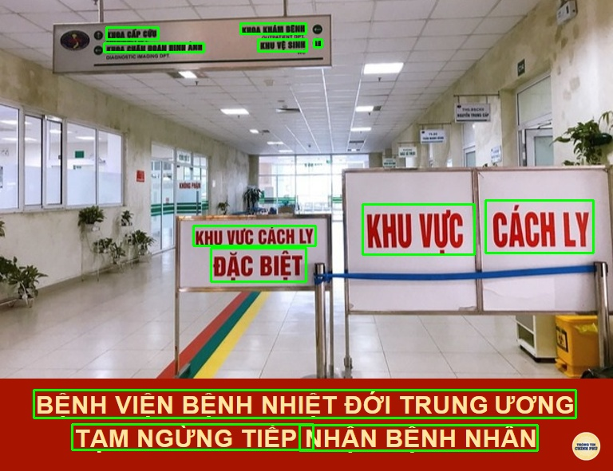

# TextExtractor
Example code xác định vị trí của text trong ảnh, được viết bằng Python sử dụng thư viện Paddle OCR

# Chuẩn bị

### Bước 1: Cài đặt Python 3.7.3
Download [python-3.7.3 x64](https://www.python.org/ftp/python/3.7.3/python-3.7.3-amd64.exe) để cài đặt, nhớ chọn "add to path"

### Bước 2: cài đặt Visual Studio 2015 trở lên để có Visual C++ 140 dùng để compile code

### Bước 3: cài đặt paddlepaddle
```
pip install paddlepaddle
```

### Bước 4: clone code https://github.com/PaddlePaddle/PaddleOCR

### Bước 5: compile code
```
python3 setup.py bdist_wheel
```

Sau bước này sẽ thấy có file paddleocr-x.x.x-py3-none-any.whl trong folder dist


### Bước 6: cài đặt file whl
```
pip3 install dist/paddleocr-x.x.x-py3-none-any.whl
```

### Bước 7: chạy chương trình
```
paddleocr --image_dir example.jpg
```

# Một số ví dụ



